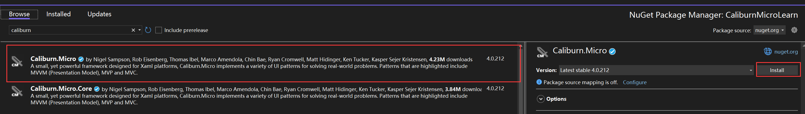
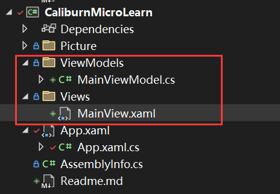
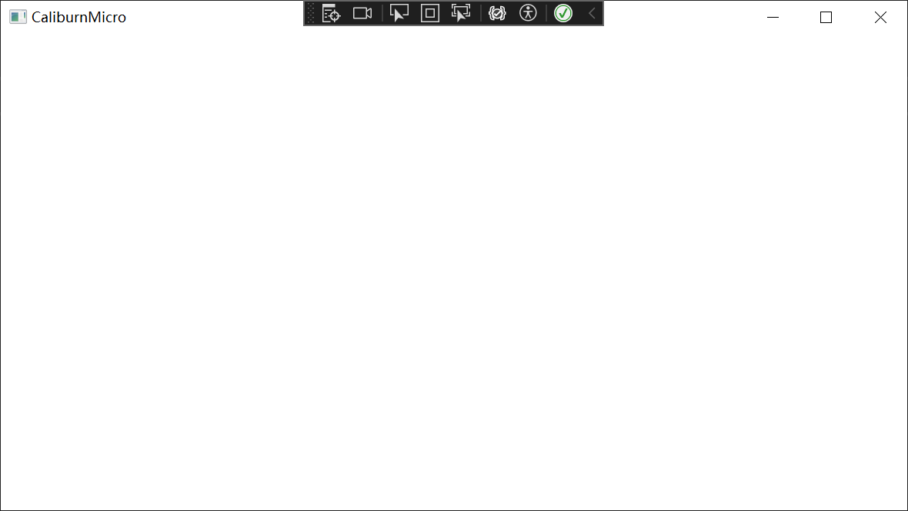

# CaliburnMicro框架的安装
在工程中安装如下的nuget包即可。  

# 工程的结构
CaliburnMicro是一个基于约定的MVVM框架，即它默认是按照名字来寻找View和ViewModel的。所以需要在工程下建立成对的Views和ViewModels文件夹，
然后在各自中添加View和ViewModel的文件。建立好的工程结构如下:
  
MainView和MainViewModel会自动关联
# 项目的启动
启动有以下几个步骤:
1. 建立Bootstrapper类并继承自BootstrapperBase
```C#
using Caliburn.Micro;
using CaliburnMicroLearn.ViewModels;
using System.Windows;

namespace CaliburnMicroLearn;

public class Bootstrapper : BootstrapperBase
{
    public Bootstrapper()
    {
        Initialize();
    }

    /// <summary>
    /// 启动时显示的页面
    /// 这里显示的是MainViewModel
    /// </summary>
    /// <param name="sender"></param>
    /// <param name="e"></param>
    protected override async void OnStartup(object sender, StartupEventArgs e)
    {
        await DisplayRootViewForAsync(typeof(MainViewModel));
    }
}
```
2. 修改App.xaml，删除StartupUri="MainWindow.xaml"，并添加如下一些xaml代码，修改后的App.xaml如下所示,
同时可以删除App.xaml.cs
```xaml
 <Application x:Class="CaliburnMicroLearn.App"
             xmlns="http://schemas.microsoft.com/winfx/2006/xaml/presentation"
             xmlns:x="http://schemas.microsoft.com/winfx/2006/xaml"
             xmlns:local="clr-namespace:CaliburnMicroLearn">
    <Application.Resources>
        <ResourceDictionary>
            <ResourceDictionary.MergedDictionaries>
                <ResourceDictionary>
                    <local:Bootstrapper x:Key="Bootstrapper" />
                </ResourceDictionary>
            </ResourceDictionary.MergedDictionaries>
        </ResourceDictionary>
    </Application.Resources>
</Application>
```
3.MainViewModel继承自Screen
```C#
using Caliburn.Micro;

namespace CaliburnMicroLearn.ViewModels;

public class MainViewModel : Screen
{

}

```
4.MainView中设置标题为CaliburnMicro，然后F5启动测试一下效果
```xaml
<Window x:Class="CaliburnMicroLearn.Views.MainView"
        xmlns="http://schemas.microsoft.com/winfx/2006/xaml/presentation"
        xmlns:x="http://schemas.microsoft.com/winfx/2006/xaml"
        xmlns:d="http://schemas.microsoft.com/expression/blend/2008"
        xmlns:mc="http://schemas.openxmlformats.org/markup-compatibility/2006"
        xmlns:local="clr-namespace:CaliburnMicroLearn.Views"
        mc:Ignorable="d"
        Title="CaliburnMicro"
        Height="450"
        Width="800">
    <Grid>

    </Grid>
</Window>
```
启动的效果如下:

看起来是成功了。