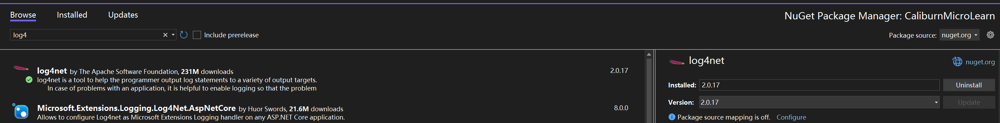
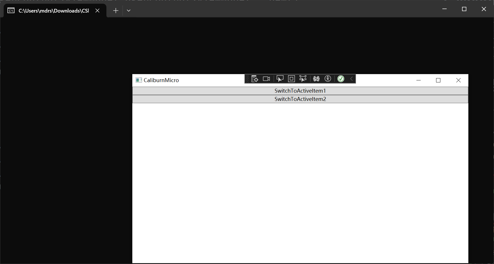
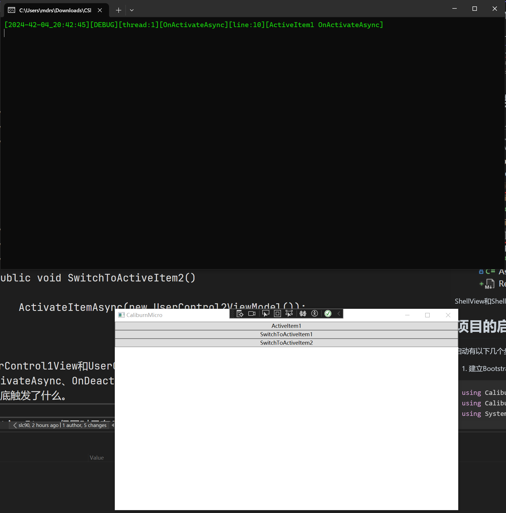
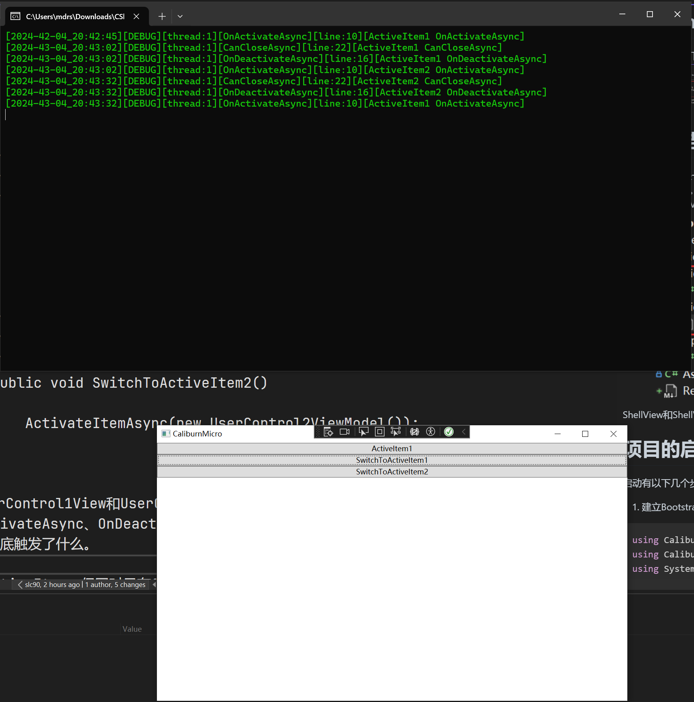

# CaliburnMicro框架的安装
在工程中安装如下的nuget包即可。  

# 工程的结构
CaliburnMicro是一个基于约定的MVVM框架，即它默认是按照名字来寻找View和ViewModel的。所以需要在工程下建立成对的Views和ViewModels文件夹，
然后在各自中添加View和ViewModel的文件。建立好的工程结构如下:
  
ShellView和ShellViewModel会自动关联
# 项目的启动
启动有以下几个步骤:
1. 建立Bootstrapper类并继承自BootstrapperBase
```C#
using Caliburn.Micro;
using CaliburnMicroLearn.ViewModels;
using System.Windows;

namespace CaliburnMicroLearn;

public class Bootstrapper : BootstrapperBase
{
    public Bootstrapper()
    {
        Initialize();
    }

    /// <summary>
    /// 启动时显示的页面
    /// 这里显示的是ShellViewModel
    /// </summary>
    /// <param name="sender"></param>
    /// <param name="e"></param>
    protected override async void OnStartup(object sender, StartupEventArgs e)
    {
        await DisplayRootViewForAsync(typeof(ShellViewModel));
    }
}
```
2. 修改App.xaml，删除StartupUri="MainWindow.xaml"，并添加如下一些xaml代码，修改后的App.xaml如下所示,
同时可以删除App.xaml.cs
```xaml
 <Application x:Class="CaliburnMicroLearn.App"
             xmlns="http://schemas.microsoft.com/winfx/2006/xaml/presentation"
             xmlns:x="http://schemas.microsoft.com/winfx/2006/xaml"
             xmlns:local="clr-namespace:CaliburnMicroLearn">
    <Application.Resources>
        <ResourceDictionary>
            <ResourceDictionary.MergedDictionaries>
                <ResourceDictionary>
                    <local:Bootstrapper x:Key="Bootstrapper" />
                </ResourceDictionary>
            </ResourceDictionary.MergedDictionaries>
        </ResourceDictionary>
    </Application.Resources>
</Application>
```
3.ShellViewModel继承自Screen
```C#
using Caliburn.Micro;

namespace CaliburnMicroLearn.ViewModels;

public class ShellViewModel : Screen
{

}

```
4.ShellView中设置标题为CaliburnMicro，然后F5启动测试一下效果
```xaml
<Window x:Class="CaliburnMicroLearn.Views.ShellView"
        xmlns="http://schemas.microsoft.com/winfx/2006/xaml/presentation"
        xmlns:x="http://schemas.microsoft.com/winfx/2006/xaml"
        xmlns:d="http://schemas.microsoft.com/expression/blend/2008"
        xmlns:mc="http://schemas.openxmlformats.org/markup-compatibility/2006"
        xmlns:local="clr-namespace:CaliburnMicroLearn.Views"
        mc:Ignorable="d"
        Title="CaliburnMicro"
        Height="450"
        Width="800">
    <Grid>

    </Grid>
</Window>
```
启动的效果如下:

看起来是成功了。
# 引入PropertyChanged.Fody
PropertyChanged.Fody能够对编译后的IL的代码进行修改，从而省去很多开发中的重复代码，像属性中很多的INotifyPropertyChanged
都能够自动加上，没必要去手写。安装方法也是从nuget安装。

然后向工程添加一个FodyWeavers.xml文件，里面的内容是这样的
```xml
<?xml version="1.0" encoding="utf-8" ?>
<Weavers>
	<PropertyChanged/>
</Weavers>
```
此时ViewModel中的属性就能自动通知UI了,每个属性变化后都会触发一个OnXXXChanged()的方法，其中XXX和属性名字一样
```C#
public class ShellViewModel : Screen
{
    public bool IsChecked { get; set; }

    public void OnIsCheckedChanged()
    {
        MessageBox.Show("123");
    }
}
```
如果不想用自动生成的方法，可以加上Attribute:OnChangedMethod(nameof(OnXXXChanged)),这样当属性变化时、
就会触发这个OnXXXChanged方法，这在多个属性变化时需要触发同一个方法比较有用。
```C#
public class ShellViewModel : Screen
{
    [OnChangedMethod(nameof(OnXXXChanged))]
    public bool IsChecked { get; set; }

    public void OnXXXChanged()
    {
        MessageBox.Show("123");
    }
}
```
# 引入Log  
1.使用nuget安装  

2.配置  
文档见(https://www.cnblogs.com/yaopengfei/p/9428206.html)，配置后的文件为log4net.config  
3.日志输出格式  
[官方文档](https://logging.apache.org/log4net/log4net-1.2.13/release/sdk/log4net.Layout.PatternLayout.html)  
4.封装  
LoggerUtils文件夹中放和Logger相关的文件。log4net.config是日志的配置文件，要把属性设置为embed resource;Logger.cs是对log4net自带的
方法的封装。
  
# 数据和事件绑定
1.Button和CheckBox之类在xaml中用x:Name设置名字，然后在ViewModel中创建一个同名的属性或函数，就能自动"关联"。例子如下:
```xaml
        <Button x:Name="TestButton"
                Grid.Row="0"></Button>
        <CheckBox x:Name="TestCheckBox"
                  Grid.Row="1"></CheckBox>
```
```C#
    /// <summary>
    /// 勾选或取消勾选CheckBox后属性自动变化
    /// </summary>
    public bool TestCheckBox { get; set; }

    public void OnTestCheckBoxChanged()
    {
        Logger.Debug($"IsChecked:{TestCheckBox}");
    }

    /// <summary>
    /// 点击按钮后触发
    /// </summary>
    public void TestButton()
    {
        Logger.Debug("Test");
    }
```  
按照上面这样设置的话，当在UI上点击按钮，就会自动触发ViewModel中的TestButton方法；勾选或取消勾选CheckBox，相关联的TestCheckBox属性也会自动变化  
2.ItemsControl中各个Item的事件绑定到同一个函数，以下代码就是当点击了ListView中每个Item时，自动触发ViewModel中的ListViewItemClick方法，
并把被点击的Item的内容作为参数传进去。这非常方便，View和ViewModel进行了分离，ViewModel中不需要拿到View中的Control。
```xaml
        <ListView ItemsSource="{Binding Names}"
                  Grid.Row="2">
            <ListView.ItemTemplate>
                <DataTemplate>
                    <Button Content="{Binding}"
                            cal:Message.Attach="[Click]=[ListViewItemClick($dataContext)]"></Button>
                </DataTemplate>
            </ListView.ItemTemplate>
        </ListView>
```
```C#
    /// <summary>
    /// 绑定到ListView的属性
    /// </summary>
    public BindableCollection<string> Names { get; set; } = ["Name1", "Name2", "Name3"];

    /// <summary>
    /// 点击ListView中的Item后触发，输出被点击的Item的内容
    /// </summary>
    /// <param name="name"></param>
    public void ListViewItemClick(string name)
    {
        Logger.Debug(name);
    }
```  
完整的有关数据和事件绑定的内容见(https://caliburnmicro.com/documentation/actions)  
# Screen和Conductor
Screen和Conductor可以"比作"是窗口和窗口管理器，对于一个窗口，一般会有各种自动触发的事件，比如窗口显示、窗口关闭事件，
而窗口管理器就是一个Collection，其中放了很多个窗口，需要对这些窗口进行状态的管理。当然，实际上Screen并不是窗口，因为
像窗口显示这种事件是ViewAware这个类实现的，比如OnViewLoaded方法。Screen是实现了IScreen这个接口，它的生命周期是Activate、
DeActivate、CanClose和TryClose。Conductor这个类分成以下3种情况:
* 只有一个ActiveItem  
    这个例子中，让ShellViewModel继承自`Conductor<IScreen>`，然后在ShellViewModel中放一个`ContentControl`，
    它的Name必须是ActiveItem，这是CaliburnMicro中规定的(可以看到ConductorBaseWithActiveItem<T>类中有个属性就是叫ActiveItem)
    ```xaml
    <Window x:Class="CaliburnMicroLearn.Views.ShellView"
        xmlns="http://schemas.microsoft.com/winfx/2006/xaml/presentation"
        xmlns:x="http://schemas.microsoft.com/winfx/2006/xaml"
        xmlns:d="http://schemas.microsoft.com/expression/blend/2008"
        xmlns:mc="http://schemas.openxmlformats.org/markup-compatibility/2006"
        xmlns:local="clr-namespace:CaliburnMicroLearn.Views"
        xmlns:cal="http://caliburnmicro.com"
        mc:Ignorable="d"
        Title="CaliburnMicro"
        xmlns:viewModels="clr-namespace:CaliburnMicroLearn.ViewModels"
        d:DataContext="{d:DesignInstance Type=viewModels:ShellViewModel,IsDesignTimeCreatable=True}"
        Height="450"
        Width="800">
    <StackPanel Orientation="Vertical">
        <ContentControl x:Name="ActiveItem"></ContentControl>
        <Button x:Name="SwitchToActiveItem1"
                Content="SwitchToActiveItem1"></Button>
        <Button x:Name="SwitchToActiveItem2"
                Content="SwitchToActiveItem2"></Button>
    </StackPanel>
    </Window>
    ```
    然后新建一个文件夹放UserControl，其中放2个不同的ViewModel，然后在ShellViewModel进行切换。具体方法和之前创建View、ViewModel一样，
    名字要一致，因为这里Conductor中的泛型为IScreen，所以新建的2个ViewModel要继承自Screen(如果不需生命周期，那只需要继承自ViewAware应该就行)。
    ShellViewModel中的代码如下，只有用来切换的功能。
    ```C#
    using Caliburn.Micro;
    using CaliburnMicroLearn.UserControl.ViewModels;

    namespace CaliburnMicroLearn.ViewModels;

    public class ShellViewModel : Conductor<IScreen>
    {
        UserControl1ViewModel UserControl1ViewModel = new();

        UserControl2ViewModel UserControl2ViewModel = new();

        /// <summary>
        /// 点击按钮SwitchToActiveItem1触发
        /// </summary>
        public void SwitchToActiveItem1()
        {
            ActivateItemAsync(UserControl1ViewModel);
        }

        /// <summary>
        /// 点击按钮SwitchToActiveItem2触发
        /// </summary>
        public void SwitchToActiveItem2()
        {
            ActivateItemAsync(UserControl2ViewModel);
        }
    }
    ```
    在UserControl1View和UserControl2View中各自放了一个按钮，但是显示的内容不同；对应的ViewModel则是重写了
    OnActivateAsync、OnDeactivateAsync、CanCloseAsync、TryCloseAsync四个方法，增加了Log输出，用来看切
    换时到底触发了什么。
    程序刚启动时还没有激活任何一个，此时的状态如下，终端什么也没显示:

    然后点击SwitchToActiveItem1，激活UserControl1ViewModel,从终端可以看到触发了OnActive这个事件:

    然后点击SwitchToActiveItem2，激活UserControl2ViewModel，从终端可以看到先触发了UserControl1ViewModel
    的CanClose和OnDeactivate事件，然后触发了UserControl2ViewModel的OnActive事件

    此时再次点击SwitchToActiveItem1，又激活了UserControl1ViewModel，先触发UserControl2ViewModel的CanClose
    和OnDeactive事件，然后触发UserControl1ViewModel的Active事件

    最后在UserControl1ViewModel已经被激活的情况下点击SwitchToActiveItem1，发现没什么反应，终端也没有输出信息，符合预期
* 有多个ActionItem，但同时只有1个处于Active中  
    和第一种的情况有2个区别: 
    1. xaml中不是放ContentControl，而是放一个ItemsControl，x:Name必须为Items 
    2. 当Items中的正处于Active的Item被DeActive或是Close时，需要从剩下的Item中自动找一个Item来Active
* 有多个ActionItem，同时可以有多个Item处于Active中  
    和第2种情况类似  
完整文档见(https://caliburnmicro.com/documentation/composition)